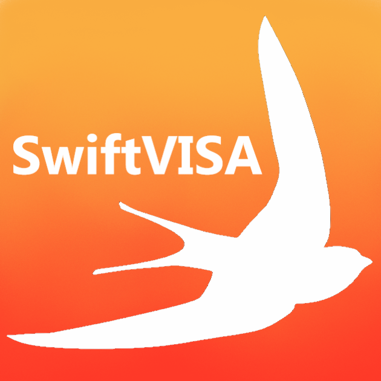

# SwiftVISA
A Swift wrapper for National Instruments VISA.

# Documentation
Open the [wiki](https://github.com/HildrethCSMFieldSession/SwiftVISA/wiki) to begin going down the rabbit hole of documentation.

# Authors
Four CS students at the Colorado School of Mines authored this for their Field Session Project.

luop90 - Luke Henke
elgisnail - Rena Loving
seeaya - Connor Barnes
ivankrukov - Ivan Krukov (who did all of his work under the HildrethCSMFieldSession account.)

# License
MIT
